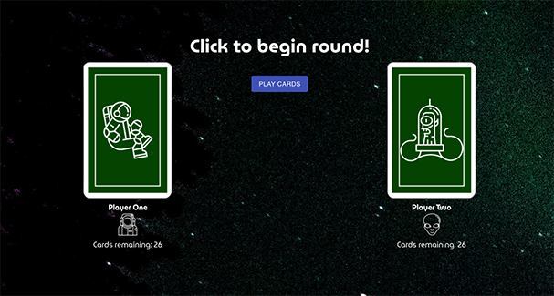

## War React.js Project

## General info
This project was created as a React.js project for a Full Stack Development Bootcamp at Digitalcrafts Atlanta in July 2020.
	
## Technologies
Project is created with:
* Create React App
* React-Redux
* Material-UI 
* Vercel

#### List of resources used:
* [Free Adventure Icons](https://dribbble.com/shots/2408773-Adventure-Icons-Freebie) created by Jakob Scott
* [Free Space Icon Set](https://speckyboy.com/freebie-the-space-icon-set-50-icons-svg-png/) by Speckyboy
* [Playing Card Images](http://acbl.mybigcommerce.com/52-playing-cards/) by American Contract Bridge League

This project was bootstrapped with [Create React App](https://github.com/facebook/create-react-app).
